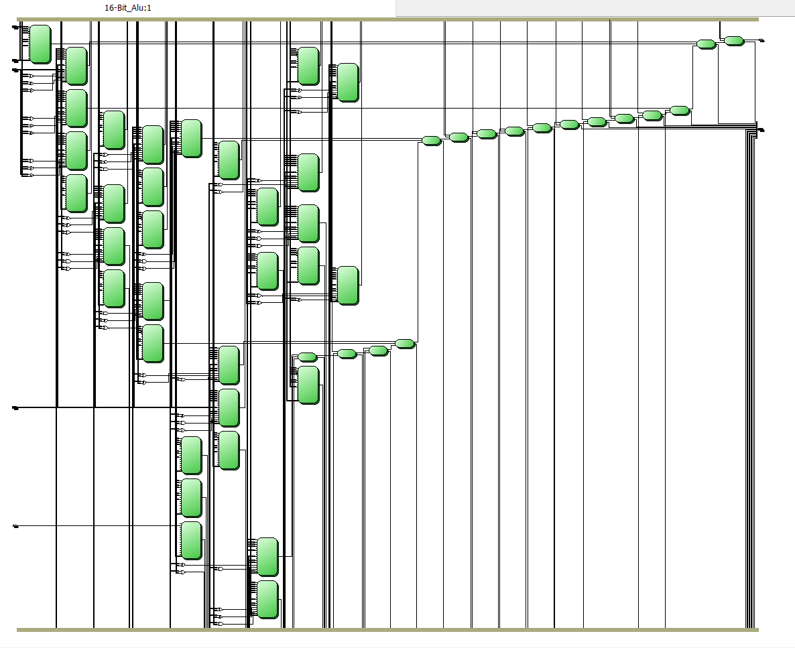
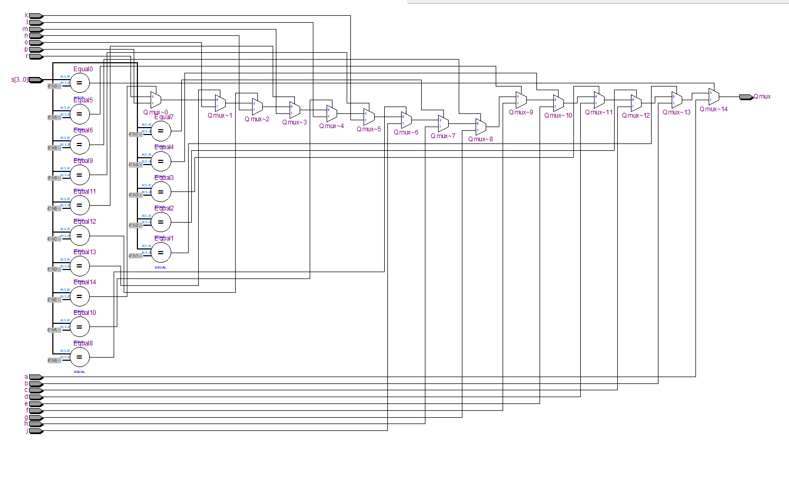
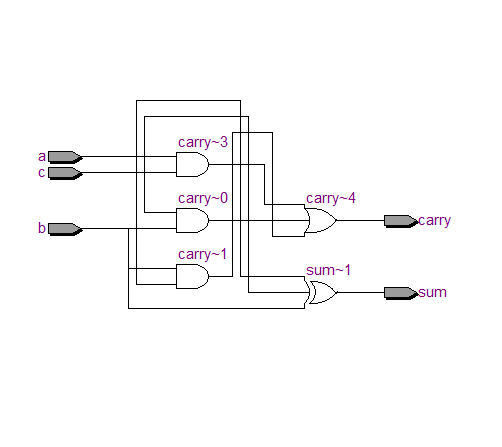

# ALU
Arithmetic Logic Unit

Function in digital computer
The ALU performs simple addition, subtraction, multiplication, division, and logic operations, such as OR and AND.

In this using:
- 16 x 1 MUX
- Full Adder
- AC Register Port and DR Register Port

## 16 bit ALU

| SELECT | OPERATION      |
| ------ | -------------- |
| 0000   | AC + DR        |
| 0001   | AC + DR + C    |
| 0010   | AC - DR        |
| 0011   | AC + DR'       |
| 0100   | Shl(AC)        |
| 0101   | AC + 1         |
| 0110   | DR             |
| 0111   | DR + 1         |
| 1000   | INP            |
| 1001   | DR - 1         |
| 1010   | AC - 1         |
| 1011   | INP + 1        |
| 1100   | AC xor DR      |
| 1101   | AC or DR       |
| 1110   | AC and DR      |
| 1111   | ror(AC)        |

## 16x1 Mux

## Full Adder

